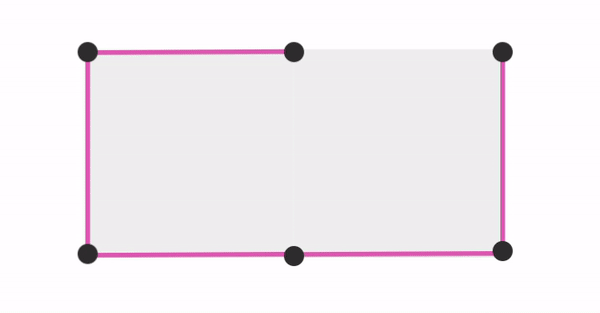

# Dots and boxes

## Introduction
### “Dots and Boxes” is a classic pencil-and-paper game for two players. The game starts with an empty grid of dots. Players take turns connecting two adjacent dots with a line. If a player completes the fourth side of a box, they score a point and take another turn. The game ends when all boxes are completed. The player with the most points wins. Strategy involves tricking the opponent into starting a chain of box completions.  See more here: [Dots and Boxes-Wikipedia](https://en.wikipedia.org/wiki/Dots_and_boxes)

## Usage
### 1.Install all files or clone this repository.
### 2.Install pygame on your local machine
 `pip  install pygame`
### 3.Run the game.py file.
 `python game.py`

## Project Working
### The Project uses python language and pygame library due to thier simplicity and lot of work is already done there. Only the game logic has to be implemented.
### First of all a screen is rendered in pygame window and filled with background colour. Then grids are drawn over it.The user can provide desired number of grids. and only square grids can be drawn for now where number of dots is same in rows and columns.
### The draw_line function takes the current mouse position and draws a faint line in the edge whichever the cursor is closest to according to the turn of player. This allows the player to easily see which edge he is drawing and thus provides smooth user experience.

### If the player clicks the mouse button. a permanent edge is added to a list and rendered in game loop in every iteration.

### The detect_box function detects if a box is formed each time a edge is drawn.
- When a horizontal edge is drawn,maximum of 2 boxes can be formed: above the edge and below the edge. Therefore by checking for existense 6 edges ,we can know  if box is formed.

- Similarly if vertical edge we have to check for left box and right box.

### If any one of the boxes is formed turn is retained and the player can move draw again. turn is stored in boolean variable since there are only 2 players.

## Game modes
### There are currently 2 game modes: `2 Player Mode` and `Bot mode`.When the game starts user can choose option whether to play with bot or with another player.

### Currently only a random bot is available which draws random moves on the grid.An edge is randomly sampled from the all possible moves list until new move is found. when new move is found it returns coordinates of endpoints of the edge.

### Classes are defined for bots so we need to instantiate Bot object on the main game file. Other bots can also be added easily if they follow the same integration approach.

## Files

### `menu.py`
#### In  `menu.py` code is written to provide a graphical user interface to the user. A pygame window is initialized and text is written over it. A portion of window is used as location of 2 buttons to choose between _2 player_  and _AI_ mode. Another small portion of window is used as input. Whenever user presses any key the text is displayed in that portion.validation is done to check limit of grid size.
### `game.py`

#### In `game.py` core game logic is written.Several utility functions are written:
- `draw_line()` --> checks mouse cursor position and draws line temporarily
- `detect_box()` --> checks if box is completed on every new edge drawn
- `draw_rectangle()` --> if a box is completed , draw square of either red or blue colour
- `handle_click()` --> when edge drawn checks if box completed and updates score
- `main()` --> An infinite loop is made where at each iteration updated edges and rectangles are rendered. Checks if game is over at every iteration.Loop is ended when game ends or user closes the window.
- `game_over_screen()` --> if game is over,displays score and winner

### `bots.py`
#### Class are defined for different bots. The bot consists of attributes edges which is updated from the `game.py` everytime edge is drawn and `update_board()` function is called.
